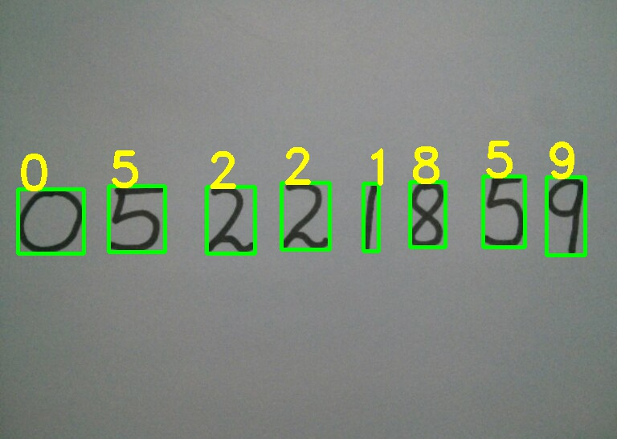

*Có rất nhiều thuật toán để nhận diện chữ số viết tay (hand writen digit) như neural network,CNN với độ chính xác rất cao lên tới 99%. Nhưng cũng không nên phủ nhận các thuật toán áp dụng theo kiểu truyền thống tuy vẫn có nhiều ưu điểm là đơn giản và chi phí tính toán thâp.Trong bài viết này chúng ta cùng tìm hiểu Hog(histogram of oriented gradient) và svm( support vector machine) để nhận dạng chữ số viết tay trên bộ dữ liệu MNIST.*
<!--truncate-->
Cấu trúc bài viết:
  - Xây dựng model nhận diện digit.
  - Predict trên ảnh có nhiều ditgit
## Xây dựng model nhận diện digit.
Dữ liệu mà chúng ta training model là mnist. Đây có thể coi là "hello word" trong machine learning. Trước hết ta tìm hiểu sơ qua về dữ liệu, mnist là tập hợp các ảnh xám về digit có chiều là 28x28 bao gồm 70.000 ngàn ảnh, trong đó có 60.000 ảnh để training và 10.000 ảnh để testing. Ý tưởng của model là dùng HOG(histogram oriented of gradient) để extract feature( các bạn có thể coi các bài trước để biết thêm hog là gì). Sau khi có feature ta sẽ đưa vào model SVM để phân loại. Cuối cùng dùng opencv đế segmentation digit và dùng model chúng ta vừa build để predict. Bắt tay vào model nào.

Đầu tiên load dataset và load các thư viện cần dùng:
```py
import cv2
import numpy as np
from skimage.feature import hog
from sklearn.svm import LinearSVC
from keras.datasets import mnist
from sklearn.metrics import accuracy_score
#load data
(X_train,y_train),(X_test,y_test) = mnist.load_data()
```
Tiếp theo ta sẽ tính hog. Ta dùng orientations=9,pixels_per_cell=(14,14),cells_per_block=(1,1).
```py
#cho x_train
X_train_feature = []
for i in range(len(X_train)):
    feature = hog(X_train[i],orientations=9,pixels_per_cell=(14,14),cells_per_block=(1,1),block_norm="L2")
    X_train_feature.append(feature)
X_train_feature = np.array(X_train_feature,dtype = np.float32)

#cho x_test
X_test_feature = []
for i in range(len(X_test)):
    feature = hog(X_test[i],orientations=9,pixels_per_cell=(14,14),cells_per_block=(1,1),block_norm="L2")
    X_test_feature.append(feature)
X_test_feature = np.array(X_test_feature,dtype=np.float32)
```
Tiếp theo ta build model vào predict
```py
model = LinearSVC(C=10)
model.fit(X_train_feature,y_train)
y_pre = model.predict(X_test_feature)
print(accuracy_score(y_test,y_pre))
```
Accuracy là 88% không cao lắm. Ta có thể điều chỉnh các tham số để tăng độ chính xác của model.
## Predict trên ảnh có nhiều ditgit
Đến bước này ta sẽ dùng opencv, đầu tiên ta sẽ xử lý ảnh và tìm contours của digit trên image.
Image này lượm trên mạng ha.

<center>
   
</center>

```py
image = cv2.imread("digit.jpg")
im_gray = cv2.cvtColor(image,cv2.COLOR_BGR2GRAY)
im_blur = cv2.GaussianBlur(im_gray,(5,5),0)
im,thre = cv2.threshold(im_blur,90,255,cv2.THRESH_BINARY_INV)
_,contours,hierachy = cv2.findContours(thre,cv2.RETR_EXTERNAL,cv2.CHAIN_APPROX_SIMPLE)
rects = [cv2.boundingRect(cnt) for cnt in contours]
```
Gải thích code một tí hem:
  - Đầu tiên convert color sang gray color
  - Tiếp theo giảm nhiễu bằng Gaussian( tùy thuộc image mà ta xử lý khác nhau)
  - Tiếp theo dùng threshold chuyển về ảnh binary
  - Cuối cùng là tìm contour và vẽ bouding box 
Sau đó predict ditgit của mỗi box.

```py
for i in contours:
    (x,y,w,h) = cv2.boundingRect(i)
    cv2.rectangle(image,(x,y),(x+w,y+h),(0,255,0),3)
    roi = thre[y:y+h,x:x+w]
    roi = np.pad(roi,(20,20),'constant',constant_values=(0,0))
    roi = cv2.resize(roi, (28, 28), interpolation=cv2.INTER_AREA)
    roi = cv2.dilate(roi, (3, 3))
    
    # Calculate the HOG features
    roi_hog_fd = hog(roi, orientations=9, pixels_per_cell=(14, 14), cells_per_block=(1, 1),block_norm="L2")
    nbr = model.predict(np.array([roi_hog_fd], np.float32))
    cv2.putText(image, str(int(nbr[0])), (x, y),cv2.FONT_HERSHEY_DUPLEX, 2, (0, 255, 255), 3)
    cv2.imshow("image",image)
cv2.imwrite("image_pand.jpg",image)
cv2.waitKey()
cv2.destroyAllWindows()
```
<!--  -->

<center>
   
</center>

Một số lưu ý là : Ta nên padding cho mỗi digit một khoảng nào đó tránh trường hợp digit ko có background sẽ khó predict. Tuy thuật toán hog + svm này có độ chính xác không cao bằng các thuật toán trong deep learning nhưng nó vẫn tạm chấp nhận được.Mình viết bài này để mọi người hình dung được các bước thực hiện thuật toán và các predict khi detection multi digit.

Tham Khảo : 
* http://hanzratech.in/
* https://pyimagesearch.com
* http://learnopencv.com