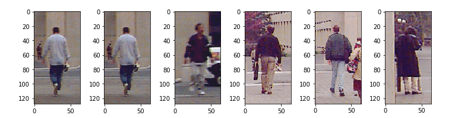
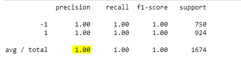
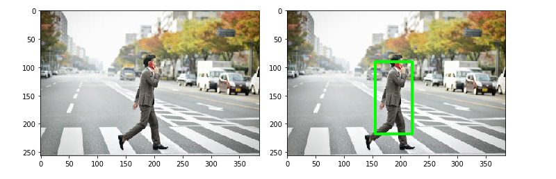
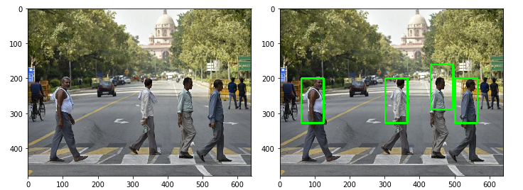

--- 
slug : Nhận-diện-pedestrian-với-window-search
title : Nhận diện pedestrian với window search
authors : thorpham
tags : [opencv, python,computer vision]
hide_table_of_contents : true
---

*Object regconite bao gồm 2 phần việc đó là object classifier và  object detection. Hiểu một cách đơn giản đó là nếu chúng ta muốn máy tính nhận dạng được con mèo hay con chó thì trước tiên nó sẽ phải detecter đối tượng đó trên image và sau đó xem đối tượng đó là cái gì bằng cách classifier .Với sự phát triển của deep learning như hiện nay đã có rất nhiều thuật toán giúp ta giải quyết vấn đề này như R-CNN,Fast or Faster R-CNN,YOLO hay SSD với tốc độ xử lý nhanh và độ chính xác cao. Tuy vậy những cách truyền thống vẫn là sự lựa chon tốt khi mà chúng ta có ít dữ liệu và muốn build một model nào đó đơn giản hơn những cái phức tạp hơn như deep learning. Trong bài này chúng ta sẽ nhận diện pedestrian bằng phương pháp cổ điển trong computer vision và sau đó bạn có thể tự build một model custom nào đó theo ý của bạn .Thuật toán sử dụng trong bài là HOG + SVM + Window search.*
<!--truncate-->
Cách bước thực hiện ta chia làm 2 giai đoạn tương ứng với classifier và detecter :

**Giai đoạn 1 classifier**
    1. Chuẩn bị dữ liệu
    2. Trích chọn đặc trưng
    3. Build model
    4. Đánh giá và cải thiện model

**Giai đoạn 2  Detection**
    1. Xây dựng sliding window
    2. Xây dựng NMS(non-maxinum-suppression)
    3. Detecter
## Giai đoạn 1 classifier

### 1. Chuẩn bị dữ liệu
Dữ liệu chúng ta cần chuẩn bị gồm 2 phần . Một là positive sample ( gọi tắt là pos) là data pedestrian và chúng ta gắn label cho nó là 1. Thứ hai là negative sample (Neg) là dữ liệu không chứa pedestrian bạn có thể lấy như background, car, house ... và ta gắn nhãn là -1.(lưu ý nếu training trong opecv thì nhãn gắn bắt buộc là 1 và -1 ).
```py
# image positive
path_pos = glob.glob("./pedestrians128x64/"+"*.ppm")
plt.subplots(figsize =(10,5))
for i in range(6):
    image1 = io.imread(path_pos[i])
    plt.subplot(1,6,i +1)
    io.imshow(image1)
# image negative
path_neg = glob.glob("./pedestrians_neg/"+"*.jpg")
```
Dữ liệu của ta gồm có 924 image pos có chiều (128, 64, 3) và ta sẽ tạo (15x50) image neg có chiều (128, 64, 3).

<center>
   <!--  -->
    
</center>

### 2. Trích chọn đặc trưng 
Ta sẽ dùng hog để trích chọn đặc trưng

```py
def hog_feature(image):
    feature_hog = hog(image,orientations=9,pixels_per_cell=(8,8),
    cells_per_block=(2,2),block_norm="L2")
    return feature_hog
    
#feature extraction for image pos    
X_pos = []
y_pos = []
for path in path_pos :
    im = io.imread(path,as_grey=True)
    im_feature = hog_feature(im)
    X_pos.append(im_feature)
    y_pos.append(1)
    
#feature extraction for image neg
X_neg = []
y_neg = []
w = 64
h = 128
for path in path_neg :
    im = io.imread(path,as_grey=True)
    for j in range(15):
        x = np.random.randint(0,im.shape[1]-w)
        y = np.random.randint(0,im.shape[0]-h)
        im_crop = im[y:y+h,x:x+w]
        im_feature = hog_feature(im_crop)
        X_neg.append(im_feature)
        y_neg.append(-1)
        
```
Đầu tiên ta định nghĩa 1 function tính hog gồm các tham số `orientations=9,pixels_per_cell=(8,8),cells_per_block=(2,2),block_norm="L2"`
Sau đó tính hog trên pos và neg sample
Cuối cùng ta stack pos và neg lại để chuẩn bị training
```py
X_pos = np.array(X_pos)
X_neg = np.array(X_neg)
X_train = np.concatenate((X_pos,X_neg))
y_pos = np.array(y_pos)
y_neg = np.array(y_neg)
y_train = np.concatenate((y_pos,y_neg))
```
Dữ liệu trining gồm có `X_traing` có shape (1674, 3780) gồm 1674 image và 3780 feature, `y_training` có shape là (1674,) gồm 2 giá trị 1 là pedestrian và -1 là non-pedestrian
### 3. Build model
Chúng ta sẽ training model bằng thuật toán svm có trong thư viện sklearn.
```py
from sklearn.svm import LinearSVC
from sklearn.metrics import classification_report
model = LinearSVC(C=0.01)
model.fit(X_train,y_train)
y_predict = model.predict(X_train)
print(classification_report(y_train,y_predict))
```
Kết quả như sau :

<center>
   <!--  -->
    
</center>

### 4. Đánh giá và cải thiện model
Amazing! kết quả accuracy = 100% . Quá cao phải ko. Nhưng đừng mừng vội vì data của chúng ta rất nhỏ và ta dùng toàn bộ data vào training mà ko chia ra data testing nên rất có thể bị overfiting. Khi đó model đưa vào hoạt động sẽ predict không tốt. Để tránh điều này
ta có thể thay đổi threshold  ( vì khi predict trên image lớn sẽ có rất nhiều non-pedestrian hơn là pedestrian).Ở trong sklearn mặc định `model.prediction` là 0.5 nên ta không thể nào thay đổi được nó. Ta chỉ có thể thay đổi qua `decision_function`

```py
from sklearn.metrics import precision_recall_curve
from sklearn.model_selection import cross_val_predict
y_scores = cross_val_predict(model, X_train, y_train, cv=3,
                             method="decision_function")[:,1]
precisions, recalls, thresholds = precision_recall_curve(y_train, y_scores)

def plot_precision_recall_vs_threshold(precisions, recalls, thresholds):
    plt.plot(thresholds, precisions[:-1], "b--", label="Precision")
    plt.plot(thresholds, recalls[:-1], "g-", label="Recall")
    plt.xlabel("Threshold")
    plt.legend(loc="center left")
    plt.ylim([0, 1])

plot_precision_recall_vs_threshold(precisions, recalls, thresholds)
```
Ta thấy khi threshold = 0 recall = 1 , khi recall = 0.8 thì threshold tăng lên 0.7
## Giai đoạn 2  Detecter
Bây giờ ta sẽ detecter pedestrian trên ảnh lớn.
### 1. Xây dựng sliding window
```py
def sliding_window(image,window_size,step_size):
    for y in range(0,image.shape[0]-window_size[1],step_size[1]):
        for x in range(0,image.shape[1]-window_size[0],step_size[0]):
            roi = image[y:y+window_size[1],x:x+window_size[0]]
            yield (x,y,roi)
```
Function `sliding_window` có 3 para : 1 là `image` (là 1 ảnh xám), hai là `window_size` có chiều (mxn) là kích thước window trên image, cuối cùng là `step_size` có chiều (w,h) là stride theo ox,oy trên image.Giá trị trả về là vị trí (x,y) tương ứng là (top-left) và roi là slide window tương ứng.
### 2. Xây dựng NMS(non-maxinum-suppression)
Ta chỉ giữ lại 1 window trên 1 object mà thôi nên ta sẽ dùng NMS để loại bỏ các window còn lại, giữ lại window tối ưu nhất.Đầu tiên ta cần tính area overlap giữa 2 window.
```py
def overlaping_area(detection_1,detection_2):
    #detection_1,detection_2 format [x_left_top,y_left_top,score,width,height]
    x_1 = detection_1[0]
    y_1 = detection_1[1]
    x_w_1 = detection_1[0] + detection_1[3]
    y_h_1 = detection_1[1] + detection_1[4]
    
    x_2 = detection_2[0]
    y_2 = detection_2[1]
    x_w_2 = detection_2[0] + detection_2[3]
    y_h_2 = detection_2[1] + detection_2[4]
    #tính overlap theo ox,oy .Nếu ko giao nhau trả về 0
    overlap_x = max(0,min(x_w_1,x_w_2) - max(x_1,x_2))
    overlap_y = max(0,min(y_h_1,y_h_2) - max(y_1,y_2))
    #tính area overlap
    overlap_area = overlap_x*overlap_y
    #tính total area hợp của 2 detection
    total_area = detection_1[3]*detection_1[4] + detection_2[3]*detection_2[4] - overlap_area
    
    return overlap_area/float(total_area)
```
Đây là bài toán tìm intersection giữa 2 rectangle bạn có thể search google xem cái giải quyết. Hàm overlaping_area sẽ trả về tỉ lệ overlap trên tổng area giữa 2 rectangle.
Tiếp theo chúng ta xây dựng làm NMS .
```py
def nms(detections,threshold =0.4):
    # decections format [x_left_top,y_left_top,score,width,height]
    # nếu area overlap lớn hơn threshold thì sẽ remove detection nào có score nhỏ hơn
    if len(detections)==0:
        return []
    #sort detection theo score
    detections = sorted(detections,key = lambda detections : detections[2],reverse = True)
    #create new detection
    new_detections = []
    new_detections.append(detections[0])
    del detections[0]
    for index,detection in enumerate(detections):
        for new_detection in new_detections:
            if overlaping_area(detection,new_detection)> threshold : #compare areaoverlap với threshold
                del detections[index]
                break
        else :
            new_detections.append(detection)
            del detections[index]
    return new_detections
```
Ý tưởng là chúng ta sẽ sort các detection theo score( decision_function) theo thứ tự giảm dần. Sau đó so sánh các detection với nhau, nếu area overlap hơn threshold thì ta sẽ giữ lại detection nào có score lớn hơn.
### 3. Detecter
Đến đây ta sẽ stack các function đã tạo lại với nhau thành một khối để detection trên ảnh lớn.

```py
image = cv2.imread("pedestrian.jpg")
image_test = cv2.cvtColor(image,cv2.COLOR_BGR2GRAY)

window_size = (64,128)
step_size = (10,10)
detections = []
downscale=1.5
scale = 0
for image_scale in pyramid_gaussian(image_test,downscale=2):
    scale += 1
    if image_scale.shape[0] < window_size[1] or image_scale.shape[1] < window_size[0]:
        break
    for (x,y,roi) in sliding_window(image_scale,window_size,step_size):
        feature = hog_feature(roi)
        predict = model.predict(feature.reshape((-1,3780)))
        score = model.decision_function(feature.reshape((-1,3780)))
        if (predict == 1) and (score>0.5):
            detections.append([x,y,np.round(score,4),window_size[0],window_size[1]])
detections = nms(detections,0.5)
for (x,y,_,w,h) in detections :
    cv2.rectangle(image,(x,y),(x+w,y+h),(0,255,0),3)
cv2.imshow("roi",image)
cv2.waitKey()
cv2.destroyAllWindows()
```
Giải thích code 1 tí:
  * Vì window size cố định mà object mỗi image sẽ có kích thước khác nhau nên ta sẽ dùng 1 function tạo image pyramid, trong bài ta sẽ sử dụng pyramid_gaussian với downscale = 2 , có nghĩa sau mỗi lần chạy image sẽ giảm xuống 1 nữa
  * Để giảm bớt nhiễu ta sẽ sử dụng score > 0.25
  * Ở đây có một nhược điểm là khi image downscale thì bounding box của ta sẽ không đổi làm cho object không được bao toàn bộ bởi bounding box mình định sẽ tăng kích thước bounding box bằng cách nhân cho nó 1 tỷ lệ bằng (downscale^scale) nhưng kết quả là bouding box quá to. Hiện giờ mình chưa tìm ra cách xử lý. Có thể xem minh họa ở hình dưới.

<center>
   <!--  -->
    
</center>
<center>
   <!--  -->
    
</center>  

## Kết luận :
Thuật toán build model nhanh tuy nhiên có một nhược điểm là predict trên camera rất delay bởi vì ta sử dụng window search nên predict rất nhiều image dẫn đến tốn thời gian rất nhiều. Ngày nay người ta đã giải quyết được vấn đề này bằng cách sử dụng selective search có nghĩa là ko search windown toàn image nữa mà search có chọn lọc, những region proposal mà có nhiều khẳn năng có object nhất điển hình là thuật toán R-CNN.

Tham Khảo : 
* http://hanzratech.in/
* https://pyimagesearch.com
* https://learnopencv.com
