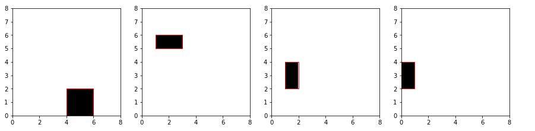
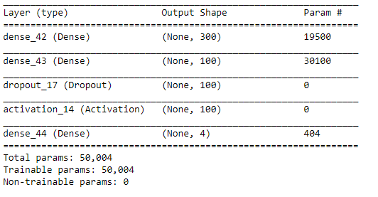
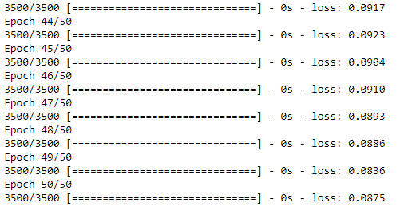
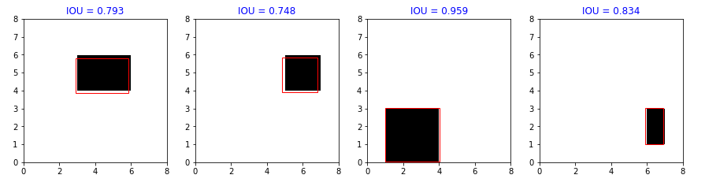

--- 
slug : Tìm-hiểu-regression-trong-object-detection
title : Tìm hiểu regression trong object detection
authors : thorpham
tags : [python,Object detection]
---
*Lần đầu tiên mình đọc về thuật toán YOLO(you look only one) là trên khóa "Convolution neural network" của thầy Andrew Ng trên coursera.
Có hàng ngàn câu hỏi vì sao ở trong đầu mình hiện ra dù đi hỏi khắp nơi mà nhiều trong số đó vẫn chưa có lời giải đáp thỏa mãn mình. Trong đó có key word `Bounding-box regression`, mình suy nghĩ rất nhiều, đọc cũng kha khá bài viết trên mạng mà vẫn không hiểu nổi. Một câu hỏi cứ lởn vởn trong đầu mình là các `bouding box` trong thuật toán yolo được tạo ra như thế nào ta, trước giờ mình chỉ dùng regression để predict  các biến liên tục vậy họ áp dụng để detection bounding box ra sao. Người ta build yolo là tổng hợp của rất nhiều thuật toán tạo nên bộ xương cho yolo .Thiết nghĩ những người mới lần đầu tập tọe vào deep learning như mình thì nên chia yolo từng phần để xử lý có lẽ sẽ dễ thở hơn. Trong bài hôm nay mình sẽ làm rõ `bounding box` được tạo ra từ regression như thế nào bằng một ví dụ rất đơn giản.*
<!--truncate-->
Các bươc thực hiện :
* Chuẩn bị dữ liệu .
* Traing model .
* Đánh giá model
  
## I.Chuẩn bị dữ liệu .
Dữ liệu `input` là những image có object mà ta muốn detection và `ouput` là những bouding box sẽ có dạng (x,y,w,h). Trong đó x,y là tọa độ leftop của bounding box, (w,h) là width và height. Chúng ta sẽ mô phỏng dữ liệu như sau :
```py
np.random.seed(10)
number_data = 5000
img_size = 8
min_size_obj = 1
max_size_obj = 4
number_obj = 1
# x là dataset image, y là label với 4 tham số(x,y,w.h)
bboxes = np.zeros((5000,1,4))
image = np.zeros((5000,img_size,img_size))
for i in range(5000):
    for obj in range(number_obj):
        w,h = np.random.randint(min_size_obj,max_size_obj,size = 2)
        x = np.random.randint(0,img_size-w)
        y = np.random.randint(0,img_size-h)
        bboxes[i,obj,:] = (x,y,w,h)
        image[i,y:y+h,x:x+w] = 1
```
Giải thích một tí :
* Ta sẽ tạo 5000 image có size (8,8) `image = np.zeros((5000,img_size,img_size))`. Image sẽ có background là white
* 5000 `bounding box` có size từ w,h từ 1-4 và có màu đen
* Mỗi image chỉ có duy nhất 1 object
Image sau khi tạo sẽ như thế này :
```py
plt.figure(figsize=(15,15))
plt.axis("off")
for i in range(4):
    plt.subplot(1,4,i+1)
    plt.imshow(image[i],cmap="Greys",interpolation='none', origin='lower', extent=[0, img_size, 0, img_size])
    for bbox in bboxes[i]:
        plt.gca().add_patch(matplotlib.patches.Rectangle((bbox[0], bbox[1]), bbox[2], bbox[3], ec='r', fc='none'))
```

Cái chúng ta cần predict là đường viền màu đỏ. Image sẽ có dimension là (5000, 8, 8) ,bounding box có dimension là (5000, 1, 4).
Chúng ta sẽ dùng một mạng neural network đơn giản để training với library keras. Ở đây người ta gọi `Bounding-box regression` trong khi dùng neural network training, rất nhiều người lầm tưởng là dùng `simple regression`. Hãy mở rộng khái niệm `regression` ra một tí, nó là bài toán predict khi output là biến liên tục. Vì bounding box ở đây (x,y,w,h) là bốn biến liên tục nên ta gọi là bài toán regression.
Đầu tiên chúng ta sẽ reshape các biến trước khi đưa vào model. Cũng có thể normalizer trước khi training để thuật toán hội tụ nhanh hơn. Nhưng do ảnh kích thước nhỏ và là binary nên không cần thiết . Sau đó chia dữ liệu thành training và testing với test_size = 0.3

```py
from sklearn.model_selection import train_test_split
X = image.reshape((5000,-1))
y = bboxes.reshape((5000,-1))
X_train,X_test,y_train,y_test = train_test_split(X,y,test_size=0.3,random_state=10)
```

* X sẽ có chiều là (5000,64) 
* y có chiều là (5000,4)
## II.Build model.

```py
from keras.models import Sequential
from keras.layers import Dense,Dropout,Activation

model = Sequential()
model.add(Dense(300,input_dim =64))
model.add(Dense(100))
model.add(Dropout(0.2))
model.add(Activation("relu"))
model.add(Dense(4))
model.compile(optimizer="adadelta",loss="mse")
model.summary()
```

* Ta dùng 2 layers : layer 1 là 300 node,layer 2 là 100 node với activation là `relu`.Cuối cùng là một layer `dropout` với tỉ lệ 20%
* Optimizer bằng `adadelta` và loss là `mean square error`.
  
<!--  -->
<center>
   
</center>

## III.Traing model

```py
model.fit(X_train,y_train,epochs=50,batch_size=200)
y_predict = model.predict(X_test)
```
* Training model với 50 epochs và batch size mỗi epochs là 200. Máy chạy cpu tầm chưa đến 1p
* Sau đó predict test data dưới variable y_predict
  
<!-- 
 -->
<center>
   
</center>


## Đánh giá model
Nhìn vào hình vẽ đầu tiền ta có nhận xét là : model predict tốt là khi đường viền màu đỏ và  `bounding box` nó càng sát nhau . Như vậy
ta có thể dùng cái này để đánh giá model. Ta đã quen với khái niệm `IOU` là `Intersection over Union`. Có nghĩa là ta sẽ đánh giá model bằng tỉ lệ area overlap với area union giữa thực tế và predict. Sau đó tính mean là sẽ ra được tỉ lệ IOU của model . IOU càng cao có nghĩa model predict tốt và ngược lại.
* Xây dựng một function tính IOU.
```py
def overlaping_area(detection_1,detection_2):
    
    x_1 = detection_1[0]
    y_1 = detection_1[1]
    x_w_1 = detection_1[0] + detection_1[2]
    y_h_1 = detection_1[1] + detection_1[3]
    
    x_2 = detection_2[0]
    y_2 = detection_2[1]
    x_w_2 = detection_2[0] + detection_2[2]
    y_h_2 = detection_2[1] + detection_2[3]
    # tính overlap theo ox,oy .Nếu ko giao nhau trả về 0
    overlap_x = max(0,min(x_w_1,x_w_2) - max(x_1,x_2))
    overlap_y = max(0,min(y_h_1,y_h_2) - max(y_1,y_2))
    # tính area overlap
    overlap_area = overlap_x*overlap_y
    # tính total area hợp của 2 detection
    total_area = detection_1[2]*detection_1[3] + detection_2[2]*detection_2[3] - overlap_area
    
    return np.round(overlap_area/float(total_area),3)
```
Cài này mình đã đề cập nhiều trong bài viết trước nên không nhắc lại ở đây.
Evaluation model bằng IOU
```py
X_test_image = X_test.reshape((-1,8,8))
bbox_y = y_predict.reshape((-1,1,4))
bbx_y_true = y_test.reshape((-1,1,4))
plt.figure(figsize=(15,15))
for i in range(4):
    iou = overlaping_area(bbox_y[i].flatten(),bbx_y_true[i].flatten())
    plt.subplot(1,4,i+1)
    plt.imshow(X_test_image[i],cmap="Greys",interpolation='none', origin='lower', extent=[0, img_size, 0, img_size])
    for bbox in bbox_y[i]:
        plt.gca().add_patch(matplotlib.patches.Rectangle((bbox[0], bbox[1]), bbox[2], bbox[3], ec='r', fc='none'))
        plt.title("IOU = "+str(iou),color='blue')
```

```py
IOU = []
for i in range(len(X_test)):
    iou = overlaping_area(bbox_y[i].flatten(),bbx_y_true[i].flatten())
    IOU.append(iou)
np.mean(IOU)
```
Ta tính được mean cua IOU `0.79` tức 79% tương đối tốt, chúng ta có thể cải thiện model bằng một số cách như : normalizer data trước khi training, thay đổi số node trên mỗi layer hoặc thay đổi active fuction
