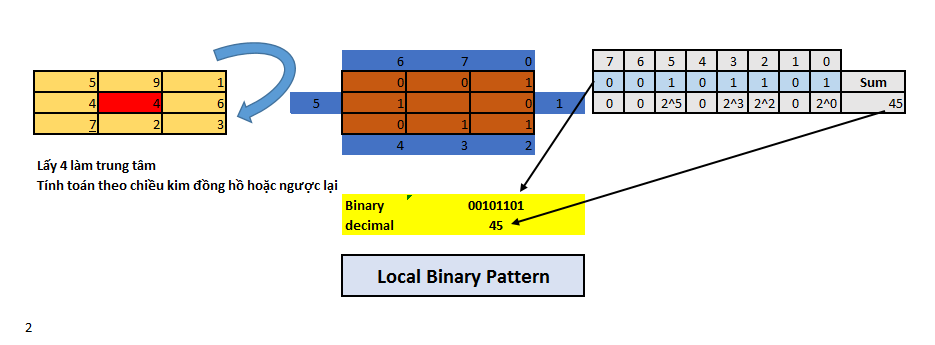
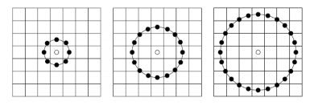
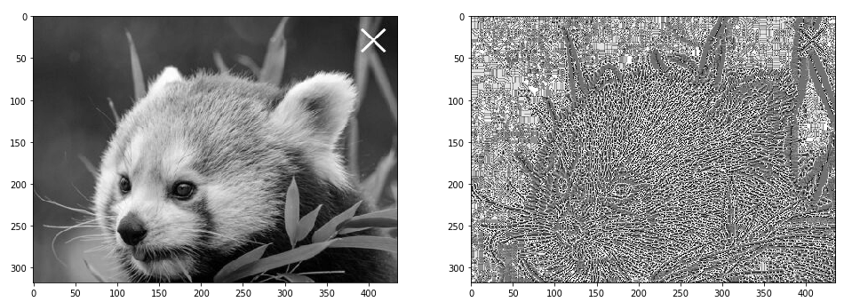

--- 
slug : Feature-extraction-trong-computer-vision
title : Feature extraction trong computer vision
authors : thorpham
tags : [Feature extraction, computer vision]
---
*Như chúng ta đã biết Feature engineering là quá trình chúng ta thực hiện trích xuất và trích chọn các đặc trưng(thuộc tính) quan trọng từ dữ liệu thô để sử dụng làm đại diện cho các mẫu dữ liệu huấn luyện.Vì vậy trong một tập dataset không phải dữ liệu nào cũng quan trọng, không phải đặc trưng nào cũng dễ nhận biết. Chính vì thế đối với mỗi loại dữ liệu sẽ có những đặc trưng riêng , trong bài viết này ta cùng tìm hiểu 2 đặc trưng quan trọng trong CV truyền thống*
<!--truncate-->
Nội dung bài viết :
1. Local binary pattern
2. Histogram Oriented of Gradient

## Local binary pattern
* Local binary pattern nó là một thuật toán mô tả texture(cầu trúc) của một image. Ý tưởng cơ bản của nó là mô phỏng lại cấu trúc cục bộ
(local texture) của image bằng cách so sánh mỗi pixel với các pixel lân cận nó(neighbors).Ta sẽ đặt một pixel là trung tâm(center) và so sánh
với các pixel lân cận với nó, nếu pixel trung tâm lớn hơn hoặc bằng pixel lân cận thì nó sẽ trả về giá trị 1, ngược lại 0. Ví dụ chúng ta
lấy bán kính 8 pixel lân cận thì lbp sẽ có dạng 11001111, là một chuỗi nhị phân để đơn giản và dễ đọc hơn ta sẽ chuyển về dạng decimal 207.

<!--  -->
 <center>
   
</center>

* Cách tính này có hạn chế đó là chỉ giới hạn 3x3 pixel không đủ để mô tả các cấu trúc large scale nên người ta mở rộng khái niệm LBP bằng cách định nghĩa thêm 2 tham số là (P,R) trong đó P là số pixel lân cận xem xét  và R là bán kính ta quét từ pixel trung tâm. Như hình bên dưới.

<!--  -->
 <center>
   
</center>
* Công thức LBP như sau :

$$
LBP_{r,p} = \sum_{n=0}^{p-1}S(X_{r,p,n}-X_{p})2^{n}
$$

 trong đó :
 
 $$ 
 S(x) =  \begin{cases}
  1, & \text{if } x >= 1, \\
  0, & \text{otherwise}.
\end{cases}
 $$
* Code trong python với skimage

```py
import numpy as np
from skimage import io
from skimage.feature import local_binary_pattern
from matplotlib import pyplot as plt
%matplotlib inline

im = io.imread("image.png",as_grey=True)
lbp = local_binary_pattern(im,8,1,method="uniform")
plt.figure(figsize=(25,25))
plt.subplot(1,3,1)
plt.imshow(im,cmap="gray")
plt.subplot(1,3,2)
plt.imshow(lbp,cmap="gray")
```

% 
 <center>
   
</center>

## Histogram Oriented of Gradient 

Histogram Oriented of Gradient (Hog) là một feature descriptor thường được dùng trong object recognition. Như chúng ta đã biết trong
image processing thì khái niệm đạo hàm rất quan trọng. Nó là cơ sở của rất nhiều thuật toán như edge,coner detection. Dựa vào đặc điểm này người ta mới xây dựng nó làm feature trên cơ sở derivative. Đạo hàm của image là một matrix theo ox và oy nó có 2 đặc trưng là độ lớn(magnitude) và hướng(direction). Để làm feature trên image thì không thể để 2 đại lượng này rời rạc được nên người ta mới nghĩ ra phương pháp chuẩn hóa nó (quantization) đó là đưa nó về dạng histogram của magnitude theo direction.Bây giờ ta tìm hiểu các bước tính toán ra hog.

 <center>
   
</center>

Các bước tính hog cụ thể. Xét trên 1 cell như trong ảnh là 8x8:
1. Tính đạo hàm của image theo x,y
$$
\begin{align*}
\nabla f(x, y)
= \begin{bmatrix}
  g_x \\
  g_y
\end{bmatrix}
= \begin{bmatrix}
  \frac{\partial f}{\partial x} \\[6pt]
  \frac{\partial f}{\partial y}
\end{bmatrix}
= \begin{bmatrix}
  f(x, y+1) - f(x, y-1)\\
  f(x+1, y) - f(x-1, y)
\end{bmatrix}
\end{align*}
$$
2. Tính magitude $g = \sqrt{ g_x^2 + g_y^2 }$ và direction $\theta = \arctan{(g_y / g_x)}$
3. Chia magitude theo 9 bins( có hướng theo direction từ 0-180 mỗi bin 20)
4. Lưu ý trên 1 block 16x16 thì để tránh ảnh hưởng của độ sáng tối ảnh hưởng tới image người ta sẽ chuẩn hóa gradient(Normalizing Gradient Vectors). Vì như chúng ta biết khi chuẩn hóa cộng hoặc trừ 1 đại lượng trên image sẽ ko làm thay đổi gradient.
5. 
Ảnh minh họa cách đưa magitude vào bin theo direction  

 <center>
   
</center>

  

Code trong python : Ta có thể dùng opencv hoặc skimage để tính hog :
  * Trong opencv: `cv2.HOGDescriptor` với các tham số win_size,block_size,block_stride,cell_size,num_bín
  * Trong skimage : `fucntion hog` với các tham số orientations, pixels_per_cell,cells_per_block