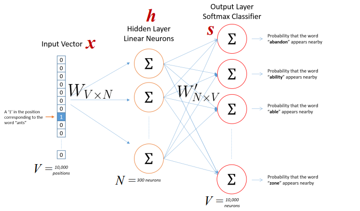

--- 
slug : Tìm-hiểu-về-Word2Vec
title : Tìm hiểu về Word2Vec
authors : thorpham
tags : [NLP, python,Word2Vec]
hide_table_of_contents : true
---
*Như chúng ta đã biết máy tính được cấu tạo từ những con số, do đó nó chỉ có thể đọc được dữ liệu số mà thôi. Trong natural language processing
thì để xử lý dữ liệu text chúng ta cũng phải chuyển dữ liệu từ text sang numeric, tức là đưa nó vào một không gian mới người ta thường
gọi là embbding. Trước đây người ta mã hóa theo kiểu one hot encoding tức là tạo  một vocabualary cho dữ liệu và mã hóa các word trong document
thành những vectoc, nếu word đó có trong document thì mã hóa là 1 còn không có sẽ là 0. Kết quả tạo ra một sparse matrix, tức là matrix hầu hết 
là 0.Các mã hóa này có nhiều nhược điểm đó là thứ nhất là số chiều của nó rất lớn (NxM, N là số document còn M là số vocabulary), thứ 2 các word
không có quan hệ với nhau. Điều đó dẫn đến người ta nghĩ ra một model mới có tên là **Word embbding**, ở đó các word sẽ có quan hệ với nhau về semantic
tức là ví dụ như paris-tokyo,man-women,boy-girl những cặp từ này sẽ có khoảng cách gần nhau hơn trong Word embbding space. Ví dụ điển hình mà ta thây
đó là phương trình king - queen = man - women . Cái ưu điểm thứ 2 là số chiều của nó sẽ giảm chỉ còn NxD.*
<!--truncate-->
Word embbding có 2 model nổi tiếng là word2vec và Glove.
Word2vec được tạo ra năm 2013 bởi một kỹ sư ở google có tên là **Tomas Mikolov**. Nó là một model unsupervised learning,được training từ large corpus . Chiều của Word2vec nhỏ hơn nhiều so với one-hot-encoding, với số chiều là NxD với N là Number of document và D là số chiều word embedding . Word2vec có 2 model là skip-gram và Cbow :
* Skip-gram model là model predict word surrounding khi cho một từ cho trước, ví dụ như text = "I love you so much". Khi dùng 1 window search có size 3 ta thu được  : `{(i,you),love},{(love,so),you},{(you,much),so}`. Nhiệm vụ của nó là khi cho 1 từ center ví dụ là love thì phải predict các từ xung quang là i, you.
* Cbow là viết tắt của continous bag of word . Model này ngược với model skip-gram tức là cho những từ surrounding predict word current.
* Trong thực tế người ta chỉ chọn một trong  2 model để training, Cbow thì training nhanh hơn nhưng độ chính xác không cao bằng skip-gram và ngược lại
Glove cũng được tạo ra năm 2013 bởi một nhóm nghiên cứu ở stanford. Nó dựa trên word-count base model. Nó dùng kỹ thuật matrix factorization để đưa matrix ban đầu về các matrix nhỏ hơn tương tự như model ở recommend system. Mình chưa nghiên cứu model này có gì nó nói lại sau qua các bài viết khác.

Cấu trúc bài:
  * Math of Word2vec 
  * Build model from scratch.
## Math of Word2vec
Trong bài này ta chỉ tìm hiểu model Skip-gram model. Cbow là model ngược lại. Skip-gram model có cấu trúc như hình vẽ dưới đây.

<center>
   <!--  -->
   
</center>

* Input là one-hot-vector mỗi word sẽ có dạng `${x_{1},x_{2},..x_{v}}$` trong đó V là số vocabulary, là một vector trong đó mỗi word sẽ có
giá trị 1 tương đương với index trong vocabulary và còn lại sẽ là 0.
* Weight matrix giữa input và hidden layer là matrix W(có dimention VxN) có active function là linear, weight giữa hidden và out put là `$W^{'}$` (có dimention là NxV) active function của out put là soft max.
* Mỗi row của W là vector N chiều đại diện cho `$v_{w}$` là mỗi word trong input layer. Mỗi row của W là `$v_{w}^{T}$` . Lưu ý là input là 1 one hot vector (sẽ có dạng 000100) chỉ có 1 phần tử bằng 1 nên.

$$
h = W^{T}x = v_{w}^{T}
$$

* Từ hidden layer đến out put là matrix `$W^{'} = {w_{i,j}^{'}}$` . Ta tính score `$u_{i}$` cho mỗi word trong vocabulary.

$$
u_{j} = v_{w_{j}}^{'}h
$$ 

* Trong đó `$v_{w_{j}}$` là vector colum j trong `$W^{'}$`. Tiếp đó ta sử dụng soft max funtion.

$$ 
P(w_{j}|w_{I}) = y_{i} = \frac{exp(u_{j})}{\sum_{j^{'}=1}^{V}exp(u_{j^{'}})} = = \frac{exp(v^{'T}_{w_{j}}v_{w_{I}})}{\sum_{j^{'}=1}^{V}exp(v^{'T}_{w_{j^{'}}}v_{w_{I}})}
$$

* Trong đó `$v_{w}$` và `$v_{w^{'}}$` là 2 vector đại diện cho word w đên từ matrix W và `$W^{'}$` .
* Người ta dùng maximum likehood với gradient descent để giải quyết bài toán này nhưng vì vocabulary lớn nên tính toán mẫu số nó tính trên toàn bộ vocabulary nên chi phí tính toán lớn nên người ta dùng 2 phương pháp giải quyết là Hierarchical Softmax hoặc Negative Sampling chi tiết trong paper "word2vec Parameter Learning Explained" của Xin Rong
## Build model from scratch.
* Model bằng math chắc chi tiết đến mấy cũng không bằng một ví dụ thực tế. Nói thật toán mình rất kém nên mình hay tìm đọc các ví dụ trực quan rồi suy ngược lại công thức toán học.
* Chúng ta sẽ xây dựng model skip-gram đơn giản như sau : Giả sử ta có đoạn text : "He is the king . The king is royal . She is the royal  queen" các bước sẽ là :
  * Làm sạch dữ liệu , lower và bỏ dấu chấm
  * Xây dựng vocabulary và 2 cái dictionary , 1 cái để tìm index theo word cái còn lại thì ngược lại
  * Tiếp theo xây dựng dữ liệu training, dùng 1 window search để stride trên text, dữ liệu sẽ có dạng  (he,is),(he,the)..
  * Mã hóa dữ liệu về numeric dựa vào 2 cái dictionary vừa tạo
  * Traing model
  * Tìm matrix word embbding vào vẽ đồ thị minh họa.
* Đầu tiên chúng ta làm sạch dữ liệu và xây dựng vocabulary . `{'queen', 'he', 'royal', 'is', 'king', 'the', 'she'}`
* Tiếp theo là 2 dictionary 
  * word theo index là `{'queen': 0, 'he': 1, 'royal': 2, 'is': 3, 'king': 4, 'the': 5, 'she': 6}`
  * Index theo word thì ngược lại : `{0: 'queen', 1: 'he', 2: 'royal', 3: 'is', 4: 'king', 5: 'the', 6: 'she'}`
  * Tiếp theo xây dựng data training sẽ có dạng :(he,is),(he,the)... trong đó cái đầu sẽ là input, cái sau sẽ là out put
  * mã hóa nó về numeric : sẽ có dạng sau :input : [ 0.,  0.,  0.,  1.,  0.,  0.,  0.] , ouput : [ 1.,  0.,  0.,  0.,  0.,  0.,  0.]
  lưu ý size vocabulary là 7
  * Ta sẽ training model : Vì vocabualary này nhỏ nên ta dùng gradient descent training loss softmax minimum luôn.
```python
import numpy as np
import tensorflow as tf

corpus_raw ="He is the king . The king is royal . She is the royal  queen"
#Convert to lower case
corpus_raw = corpus_raw.lower()

words = []
for word in corpus_raw.split():
    if word != ".": #we need remove "."
        words.append(word)
words = set(words) #We create dictionary so remove duplicate word

word2int = {}
int2word = {}
vocab_size = len(words)
for i,word in enumerate(words):
    word2int[word] = i
    int2word[i] = word
#Raw sentence as list 
raw_sentence = corpus_raw.split(".")
sentences = []
for sentence in raw_sentence:
    sentences.append(sentence.split())
#Generate training data
data = []
Window_size = 2
for sentence in sentences :
    for word_index,word in enumerate(sentence):
        for nb_word in sentence[max(word_index - Window_size,0): min(word_index+ Window_size,len(sentence)) +1 ]:
            if nb_word != word :
                data.append([word,nb_word]) 
 #function to convert numbers to one hot vectors
def to_one_hot(data_point_index, vocab_size):
    temp = np.zeros(vocab_size)
    temp[data_point_index] = 1
    
x_train = [] #input word
y_train = [] #output word
for data_word in data:
    x_train.append(to_one_hot(word2int[ data_word[0] ], vocab_size))
    y_train.append(to_one_hot(word2int[ data_word[1] ], vocab_size))
  

x_train = np.asarray(x_train)
y_train = np.asarray(y_train)
    return temp  
    
#placeholder
X = tf.placeholder(tf.float32,[None,7])
Y = tf.placeholder(tf.float32,[None,7])
#variable hiden 1
W1 = tf.Variable(tf.random_normal([7,5]))
b1 = tf.Variable(tf.constant(0.1,shape =[5]))
hiden_1 = tf.matmul(X,W1) + b1
#variable hiden 2
W2 = tf.Variable(tf.random_normal([5,7]))
b2 = tf.Variable(tf.constant(0.1,shape = [7]))
hiden_2 = tf.matmul(hiden_1,W2) + b2
#loss function
cross_entropy = tf.reduce_mean(tf.nn.softmax_cross_entropy_with_logits(labels = Y,logits=hiden_2))
#optimizer
optimizer = tf.train.GradientDescentOptimizer(learning_rate=0.01).minimize(cross_entropy)
#initializer
init = tf.global_variables_initializer()
sess = tf.Session()
sess.run(init)
for i in range(1000):
    sess.run(optimizer,feed_dict={X:x_train,Y:y_train})
predict = tf.equal(tf.arg_max(hiden_2,1),tf.arg_max(Y,1))
accuracy = tf.reduce_mean(tf.cast(predict,tf.float32))
```